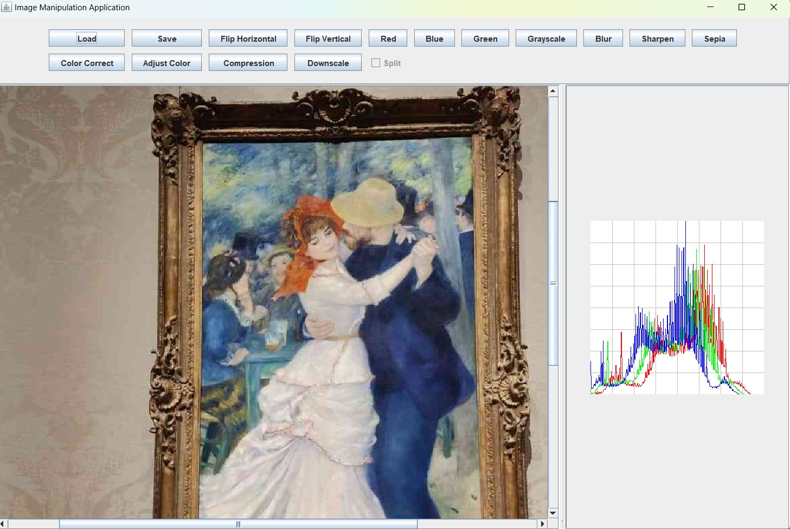

## Views

## GUI
Run the following command on terminal to run the script file with the given path.
```sh
java -jar Program.jar -file path-of-script-file
````
or double-click on the jar file



- `load button`: This button will open a file chooser where you can select an image of the supported type.
- `save button`: This button will let you save the image to the directory of your choice.
- `red`,`blue`,`green`,`grayscale`: these buttons will show you a grayscale image with red,blue,green and luma channel respectively.
- `horizontalFLip`,`verticalFLip`: These buttons will flip the images horizontally or vertically.
- `blur`: Gives an image that has a gaussian blur applied.
- `sharpen`: Shows a sharpened version of the image.
- `sepia`: Applies sepia filter on the image.
- `compress`: This button will ask for an input where you have to enter a number between 0 - 100 that will give you a compressed artifact of the image with respective to the number provided.
- `colorCorrection`: Color corrects the image.
- `levelAdjust`: Asks for the black, mid and white points that should be between 0-255 and in ascending order.
- `downscale`: Asks for a new width and height to adjust the image.
- `split`: Clicking this after applying a filter lets you preview between the operation and the original image where you can choose to apply the filter or cancel. 
Operations supported by split as of now: `red`,`blue`,`green`,`grayscale`,`red`,`blur`,`sharpen`,`sepia`

Example image with `split` after `grayscale`


  


## Script File Execution
Run the following command on terminal to run the script file with the given path.
```sh
java -jar Program.jar -file path-of-script-file
````

## Interactive shell
Run the following command on terminal to activate the interactive shell.
```sh
java -jar Program.jar -text
````
The following commands can be executed:

- `run script-file`: Loads and runs commands from the script.
- `exit`: Exits the program.
- `load image-path image-name`: Loads an image and associates it with a name to be used further.
- `save image-path image-name`: Saves the image to the given path.
- `red-component image-name dest-image-name`: Extracts the red component of an image.
- `green-component image-name dest-image-name`: Similar to `red-component` but extracts green component.
- `blue-component image-name dest-image-name`: Similar to `red-component` but extracts blue component.
- `luma-component image-name dest-image-name`: Creates an image using the weighted sum `0.2126r + 0.7152g + 0.0722b`.
- `value-component image-name dest-image-name`: Creates an image using the maximum value of the RGB components.
- `intensity-component image-name dest-image-name`: Similar to `value-component` but uses the average of the RGB values.
- `horizontal-flip image-name dest-image-name`: Flips the image horizontally 
- `vertical-flip image-name dest-image-name`: Flips the image vertically.
- `brighten increment image-name dest-image-name`: Brightens or darkens the image based on the increment being positive or negative.
- `rgb-split image-name dest-image-name-red dest-image-name-green dest-image-name-blue`: Splits the RGB channel from a given image.
- `rgb-combine image-name red-image green-image blue-image`: combines RGB channels.
- `blur image-name dest-image-name`: Blurs the image.
- `sharpen image-name dest-image-name`: Sharpens the image.
- `sepia image-name dest-image-name`: Applies a sepia filter to the image.
- `compress percentage image-name dest-image-name`: Create a compression version of an image.
- `histogram image-name dest-image-name`: Produce an image that represents the histogram of a given image.
- `color-correct image-name dest-image-name`: Color-correct an image by aligning the meaningful peaks of its histogram.
- `levels-adjust b m w image-name dest-image-name`: Adjust levels of an image where b, m and w are the three relevant black, mid and white values respectively.


Optional Parameters:
- `split p`: ability to specify a vertical line to generate a split view of operations.

Example:

- `blur image-name dest-image split p`: 'p' is a percentage of the width (e.g. 50 means place the line halfway through the width of the image).
- The operations that must support this are **blur, sharpen, sepia, greyscale, color correction and levels adjustment**.

New Commands:
Optional Parameters:
- `mask-image`: Masking class is called as an optional parameter and supports ability to apply any of the existing image manipulations to only part of an image.

Example:

- `blur source-image mask-image dest-image` should blur the source image as per the mask image assuming that the mask image already exists.
- The operations that must support this are **blur, sharpen, sepia, greyscale, channel **.


*All the images used in the project are owned or created by the owners of the repo and you are free to use them

## Example Commands
```sh
load MFAImage.jpeg MFAImage
color-correct MFAImage MFAImage-color-correct
histogram MFAImage-color-correct MFAImage-color-correct-histogram
save resImages/MFAImage-color-correct.jpeg MFAImage-color-correct
save resImages/MFAImage-color-correct-histogram.jpeg MFAImage-color-correct-histogram
exit

#read the file in the given path and run commands
run scripts/Script.txt
exit
```

## Example Script
```sh

#load MFAImage.jpeg and call it 'MFAImage'
load MFAImage.jpeg MFAImage


#blurred MFAImage
blur MFAImage MFAImageBlur
blur MFAImageBlur MFAImageBlurTwice
#Splitview of Blur 50%
blur MFAImageBlur MFAImageBlurTwice-50 split 50

#blue channel of MFAImage
blue-component MFAImage MFAImage-blue
#splitview of blueImage
blue-component MFAImage MFAImage-blue-50 split 50

#brighten 50 MFAImage
brighten 50 MFAImage MFAImage-brighter

#Color Correct MFAImage
color-correct MFAImage MFAImageColorCorrected
#Histogram of Color corrected Image
histogram MFAImageColorCorrected MFAImageColorCorrected-histogram
#Splitview of ColorCorrected 50%
color-correct MFAImage MFAImageColorCorrected-50 split 50

#Compress
compress 50 MFAImage MFAImage-compressed
#Histogram of compressed Image
histogram MFAImage-compressed MFAImage-compressed-histogram

#Compress
compress 80 MFAImage MFAImage-compressed2
#Histogram of compressed Image2
histogram MFAImage-compressed2 MFAImage-compressed2-histogram

#green channel of MFAImage
green-component MFAImage MFAImage-green
#splitview of greenImage
green-component MFAImage MFAImage-green-50 split 50


#Histogram of MFAImage
histogram MFAImage MFAImage-histogram


#Intensity channel of MFAImage
intensity-component MFAImage MFAImage-intensity
#splitview of intensity channel
intensity-component MFAImage MFAImage-intensity-50 split 50

#Level Adjusted MFAImage
levels-adjust 20 100 200 MFAImage MFAImage-levels-adjust
#Histogram of level adjusted Image
histogram MFAImage-levels-adjust MFAImage-levels-adjust-histogram

#Level Adjusted MFAImage2
levels-adjust 30 150 180 MFAImage MFAImage-levels-adjust2
#Histogram of level adjusted Image
histogram MFAImage-levels-adjust2 MFAImage-levels-adjust2-histogram


#Luma channel of MFAImage
luma-component MFAImage MFAImage-luma
#splitview of intensity channel
luma-component MFAImage MFAImage-luma-50 split 50

#Red channel of MFAImage
red-component MFAImage MFAImage-red
#splitview of Red channel
red-component MFAImage MFAImage-red-50 split 50


#Sepia filter on MFAImage
sepia MFAImage MFAImage-sepia
#Splitview Sepia filter on MFAImage
sepia MFAImage MFAImage-sepia-50 split 50

#SharpenedMFAImage
sharpen MFAImage MFAImage-sharpen
#Splitview Sharpen
sharpen MFAImage MFAImage-sharpen-50 split 50

#create a greyscale using only the value component, as an image MFAImage-greyscale
value-component MFAImage MFAImage-value
#splitview
value-component MFAImage MFAImage-value-50 split 50

#flip MFAImage vertically
vertical-flip MFAImage MFAImage-vertical

#flip the vertically flipped koala horizontally
horizontal-flip MFAImage-vertical MFAImage-vertical-horizontal

#Split MFA Image into red,green and blue channel
rgb-split MFAImage MFAImage-red MFAImage-green MFAImage-blue
#brighten just the red image
brighten 50 MFAImage-red MFAImage-red
#combine them back, but by using the brightened red we get a red tint
rgb-combine MFAImage-red-tint MFAImage-red MFAImage-green MFAImage-blue

#Masking components
load MaskImage.png Mask
blur MFAImage Mask MFABlurMask
sharpen MFAImage Mask MFASharpenMask
luma-component MFAImage Mask MFALumaMask
value-component MFAImage Mask MFAValueMask
intensity-component MFAImage Mask MFAIntensityMask
sepia MFAImage Mask MFASepiaMask
red-component MFAImage Mask MFARedMask
green-component MFAImage Mask MFAGreenMask
blue-component MFAImage Mask MFABlueMask

save resImages/MFABlurMask.jpeg MFABlurMask
save resImages/MFASharpenMask.jpeg MFASharpenMask
save resImages/MFALumaMask.jpeg MFALumaMask
save resImages/MFAValueMask.jpeg MFAValueMask
save resImages/MFAIntensityMask.jpeg MFAIntensityMask
save resImages/MFASepiaMask.jpeg MFASepiaMask
save resImages/MFARedMask.jpeg MFARedMask
save resImages/MFAGreenMask.jpeg MFAGreenMask
save resImages/MFABlueMask.jpeg MFABlueMask


#save images
save resImages/MFAImageBlurTwice.jpeg MFAImageBlurTwice
save resImages/MFAImageBlurTwice50.jpeg MFAImageBlurTwice-50

save resImages/MFAImageBlue.jpeg MFAImage-blue
save resImages/MFAImageBlue50.jpeg MFAImage-blue-50

save resImages/MFAImage-brighter.jpeg MFAImage-brighter

save resImages/MFAImageColorCorrected.jpeg MFAImageColorCorrected
save resImages/MFAImageColorCorrected50.jpeg MFAImageColorCorrected-50

save resImages/MFAImageCompressed.png MFAImage-compressed

save resImages/MFAImage-vertical.jpeg MFAImage-vertical
save resImages/MFAImage-vertical-horizontal.jpeg MFAImage-vertical-horizontal

save resImages/MFAImageGreen.jpeg MFAImage-green
save resImages/MFAImageGreen50.jpeg MFAImage-green-50

save resImages/MFAImageHistogram.jpeg MFAImage-histogram

save resImages/MFAImageIntensity.jpeg MFAImage-intensity
save resImages/MFAImageIntensity50.jpeg MFAImage-intensity-50

#LevelCorrected
save resImages/MFAImage-levels-adjust.jpeg MFAImage-levels-adjust

save resImages/MFAImageLuma.jpeg MFAImage-luma
save resImages/MFAImageLuma50.jpeg MFAImage-luma-50

save resImages/MFAImageRed.jpeg MFAImage-red
save resImages/MFAImageRed50.jpeg MFAImage-red-50

save resImages/MFAImageSepia.jpeg MFAImage-sepia
save resImages/MFAImageSepia50.jpeg MFAImage-sepia-50

save resImages/MFAImageSharpened.jpeg MFAImage-sharpen
save resImages/MFAImageSharpened50.jpeg MFAImage-sharpen-50

save resImages/MFAImageValue.jpeg MFAImage-value
save resImages/MFAImageValue50.jpeg MFAImage-value-50

save resImages/MFAImage-red-tint.jpeg MFAImage-red-tint

save resImages/MFAImage-levels-adjust2.jpeg MFAImage-levels-adjust2
save resImages/MFAImage-compressed2.jpeg MFAImage-compressed2

save resImages/MFAImage-compressed-histogram.jpeg MFAImage-compressed-histogram
save resImages/MFAImage-compressed2-histogram.jpeg MFAImage-compressed2-histogram
save resImages/MFAImageColorCorrected-histogram.jpeg MFAImageColorCorrected-histogram
save resImages/MFAImage-levels-adjust-histogram.jpeg MFAImage-levels-adjust-histogram
save resImages/MFAImage-levels-adjust2-histogram.jpeg MFAImage-levels-adjust2-histogram


```
